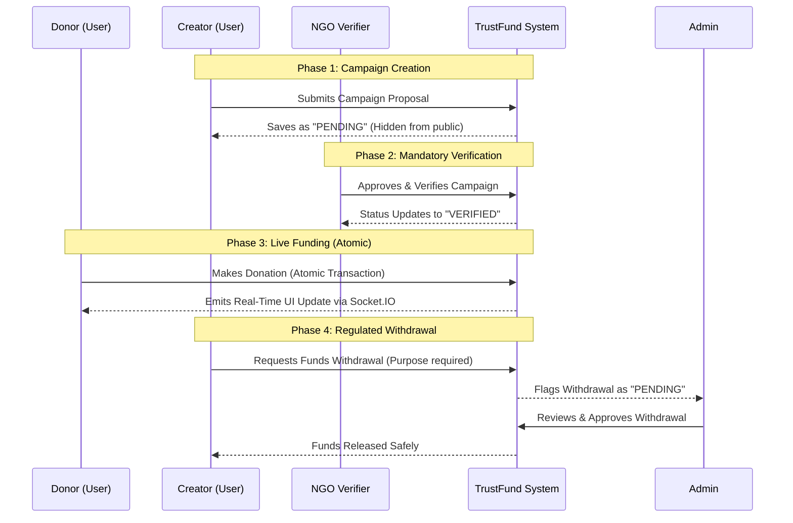

<div align="center">

# 🛡️ TrustFund
### **Transparent, NGO-Verified Crowdfunding Platform**

[](https://reactjs.org/)
[](https://nodejs.org/)
[](https://www.prisma.io/)
[](https://socket.io/)
[](https://tailwindcss.com/)

*Empowering communities by bringing absolute transparency and verified trust back into digital philanthropy.*

[Explore Features](#-key-features) • [System Workflow](#-system-workflow) • [Getting Started](#-getting-started) • [Architecture](#-tech-stack)

---
</div>

## 💡 The Problem & Our Solution
Charitable donations are often hindered by a lack of trust. Donors hesitate because they cannot verify if a campaign is legitimate or if their funds are actually reaching the intended destination.

**TrustFund** bridges this gap. By strictly requiring third-party, authorized Non-Governmental Organizations (NGOs) to verify proposed campaigns before they ever go live, we guarantee that every campaign is backed by an official entity. Using atomic database transactions and real-time socket tracking, donors can visibly track every rupee with zero doubt.

---

## 🌊 System Workflow

Below is the lifecycle of a TrustFund campaign, ensuring high security and integrity from proposal to payout.



---

## ✨ Key Features

*   🔒 **Role-Based Access Control (RBAC):** Distinct workflows for `USER`, `NGO`, and `ADMIN` ensure proper separation of concerns.
*   🛡️ **Pre-Verification Quarantine:** Campaigns remain strictly hidden from the public until rigorously vetted by an approved NGO.
*   💳 **Atomic Financial Transactions:** Utilizing Prisma `$transaction`, donation amounts and campaign totals are processed at the exact same millisecond to prevent race conditions.
*   ⚡ **Real-Time Data Streaming:** **Socket.IO** rooms instantly broadcast incoming donations to active viewers without requiring a page refresh.
*   🏦 **Regulated Withdrawals:** Creators cannot exceed their balance, and all withdrawals require secondary Admin or NGO approval.
*   🕵️‍♂️ **Secure Anonymity:** Donors can optionally mask their identity seamlessly via backend logic, protecting their data across all public endpoints.

---

## 🛠️ Tech Stack

### Frontend 💻
*   **Framework:** React 18 (Vite)
*   **Routing:** React Router DOM v6
*   **Styling:** Tailwind CSS (Modern aesthetic, fully responsive)
*   **Data Fetching:** Axios with JWT interceptors
*   **Real-time:** `socket.io-client` with custom React Hooks
*   **Forms & Validation:** `react-hook-form` + `zod`

### Backend ⚙️
*   **Runtime:** Node.js
*   **Framework:** Express.js
*   **Database:** MySQL
*   **ORM:** Prisma ORM (Type-safe, schema-driven)
*   **Authentication:** JWT (JSON Web Tokens), `bcryptjs`
*   **Security:** `express-rate-limit`, Zod input validation
*   **Real-time Server:** `socket.io`

---

## 📂 Project Structure

```text
TrustFund/
├── frontend/                 # React Application
│   ├── src/
│   │   ├── api/              # Axios client and API route definitions
│   │   ├── components/       # Reusable UI (Navbar, Layout, Protected Routes)
│   │   ├── context/          # React Context (AuthContext)
│   │   ├── hooks/            # Custom hooks (useSocket)
│   │   └── pages/            # Role-specific dashboard & public views
│   └── index.css             # Tailwind base & global styles
│
└── backend/                  # Node.js API
    ├── prisma/
    │   ├── schema.prisma     # Database models & enums
    │   └── seed.js           # Database population script
    ├── src/
    │   ├── controllers/      # Business logic (Auth, Donations, Admin, etc.)
    │   ├── middleware/       # JWT Authorization & RBAC guards
    │   ├── routes/           # Express router endpoints
    │   └── utils/            # Prisma singleton instance
    └── index.js              # Server entry point & Socket configuration
```

---

## 🚀 Getting Started

Follow these instructions to run the project locally.

### Prerequisites
*   Node.js (v18 or higher)
*   MySQL Instance running locally

### 1. Database Configuration
Navigate to the `backend` directory, duplicate the environment file, and configure your database.
```bash
cd backend
cp .env.example .env
```
*Update `DATABASE_URL` in `.env` with your MySQL credentials.*

### 2. Run the Backend
```bash
# Install backend dependencies
npm install

# Push the Prisma schema to create MySQL tables
npx prisma db push

# Seed the database with ready-to-test accounts and dummy data
npm run db:seed

# Start the server (runs on port 4000)
npm run dev
```

### 3. Run the Frontend
Open a **new terminal tab**:
```bash
cd frontend

# Install frontend dependencies
npm install

# Start the Vite development sever
npm run dev
```
> The web application will now be running at `http://localhost:5173`.

---

## 🧪 Demo Credentials

If you ran the `npm run db:seed` command during setup, you can immediately test the platform using these pre-configured accounts:

| Role | Email | Password |
| :--- | :--- | :--- |
| **Admin Regulator** | `admin@trustfund.pk` | `admin123` |
| **NGO Verifier** | `ngo@trustfund.pk` | `ngo123` |
| **Donor / Creator** | `donor@trustfund.pk` | `donor123` |

<div align="center">
  <br />
  <b>Built for Hackathon 2026.</b>
</div>
